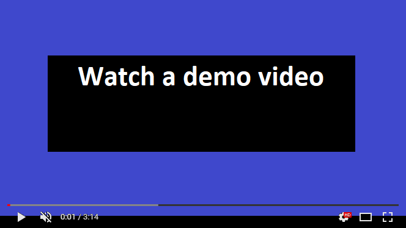

# How to use:

-> install "opencv", "pathlib" and "os" modules using conda ou pip.

-> Edit the fish_lane_analyzer.py and change some parameters like image stack path and how many frames to skip for each frame analyzed. These parametrs can be changed in the first lines of the code.

-> Then, run the file fish_lane_analyzer.py.

-> A video file and a CSV file will be created with results.

-> The CSV file can be analyzed using pandas Dataframe

